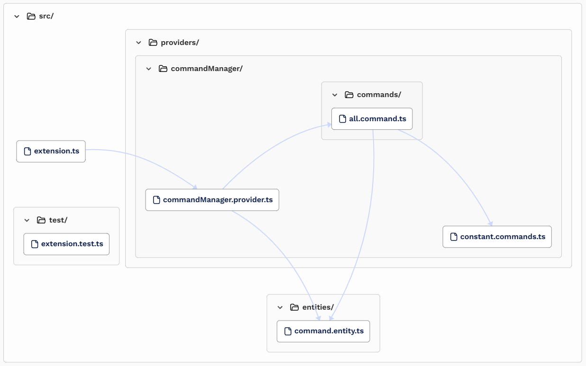

# [ extarch ] - Extension Architecture

ExtArch short for Extension Architecture is a tool to help you create a new extension for Visual Studio Code. It provides a comprehensive architecture for your extension and a set of tools to help you develop and test your extension.

## Features

### Command creation, configuration and registration

#### Steps

> 1 - Create your command in the `constant.commands.ts` file

```ts
export const CommandId = {
    YourCommandName: "[package-name].[cmdYourCommandName]",
};
```

---

> 2 - Configure your command interaction in the `package.json` in the `Contributes section`

```json
"contributes": {
        "commands": [
            {
                "command": "[package-name].[cmdYourCommandName]",
                "title": "Your Command Name",
                "category": "ExtArch"
            }
        ],
        "keybindings": [
            {
                "command": "[package-name].[cmdYourCommandName]",
                "key": "your shortcut",
            }
        ],
        "menus": {
            "commandPalette": [
                {
                    "command": "[package-name].[cmdYourCommandName]",
                    "when": "true"
                },
            ]
        }
    },
```

---

> 3 - Implement your command in the `src/providers/commands` folder.
>
> -   Create your command file name with the same of your command name for consistency.
> -   File: `cmdYourCommandName.command.ts`
> -   Example of a command implementation:

```ts
export const cmdYourCommandName = new Command(CommandId.HelloTwitch, yourCommandName);
function yourCommandName() {
    vscode.window.showInformationMessage("Hello From My Command!");
}
```

> -   In the `new Command class` you can also pass an extra parameter (boolean) to the constructor to specify if the command is going to be executed in the Extension Activation event. The default value is `false`, making the command to be executed only when the user calls it.

---

> 4 - Register your command in the `commandManager.provider.ts` file. Just add your command in the `addRegisteredCommands array`:

```ts
 /* Register all commands */
    private addRegisteredCommands() {
        /* Add new commands here */
        this._registeredCommands.push(cmdYourCommandName);
    }
```

---

#### Command Architecture Diagram



## Requirements

To create an extension make sure you have the most up to date scaffold tool installed:

```bash
npm install -g yo generator-code
```

Creating an extension:

```bash
yo code
```

Make sure you select the TypeScript option.

## Known Issues

Calling out known issues can help limit users opening duplicate issues against your extension.

Open issues [Here](https://github.com/rsaz/extarch/issues)

## Release Notes

### 0.0.1

Initial release of the command architecture.

---

## Following extension guidelines

Ensure that you've read through the extensions guidelines and follow the best practices for creating your extension.

-   [Extension Guidelines](https://code.visualstudio.com/api/references/extension-guidelines)

## Working with Markdown

You can author your README using Visual Studio Code. Here are some useful editor keyboard shortcuts:

-   Split the editor (`Cmd+\` on macOS or `Ctrl+\` on Windows and Linux).
-   Toggle preview (`Shift+Cmd+V` on macOS or `Shift+Ctrl+V` on Windows and Linux).
-   Press `Ctrl+Space` (Windows, Linux, macOS) to see a list of Markdown snippets.

## For more information

-   [Visual Studio Code's Markdown Support](http://code.visualstudio.com/docs/languages/markdown)
-   [Markdown Syntax Reference](https://help.github.com/articles/markdown-basics/)

**Enjoy!**
